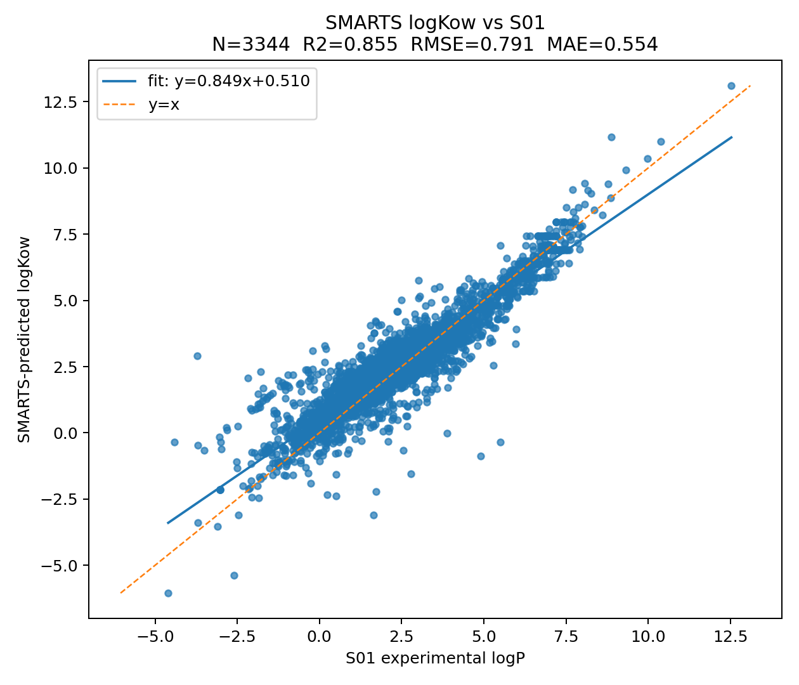
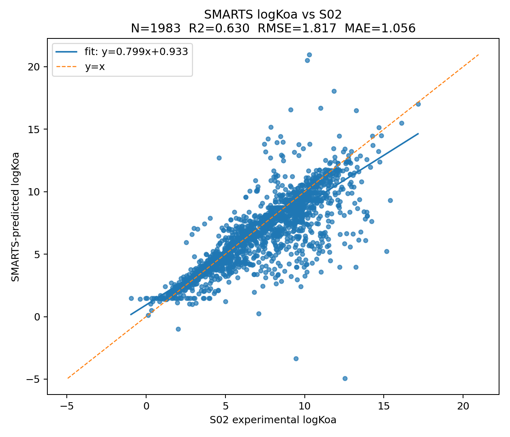
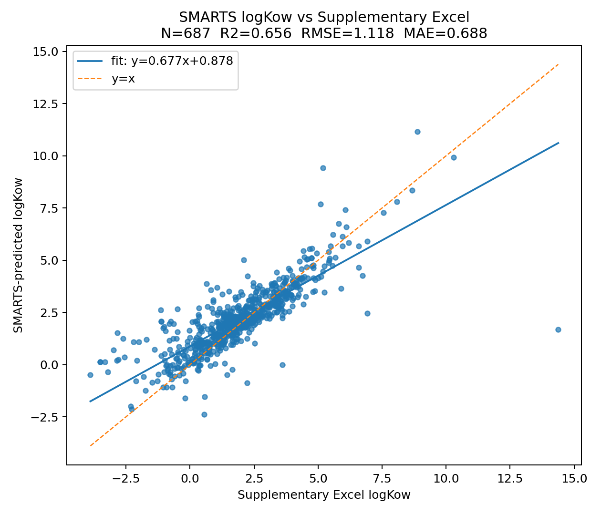

# Kawow (under development)

[](https://github.com/LucMiaz/kawow/actions/workflows/ci.yml)
[](https://www.python.org/)
[](LICENSE)


Group-additivity prediction of **log*K*ow**, **log*K*oa**, and **log*K*aw** from molecular structure.

*Kawow* implements some models to predict partitioning coefficients (`logKoa`, `logKow` and `logKaw`), in particular the Naef & Acree (2024) group-additivity scheme using RDKit SMARTS pattern matching. Two model families are available depending on how much transparency or accuracy is required.

### Flagging criteria used in outputs

`run_models(...)` returns B/vB and M/vM flags derived from predicted partition values:

- `B`: `logKoa >= 6` and `logKow >= 2`
- `vB`: `logKoa >= 6` and `logKow >= 5`

based on `doi:10.1126/science.1138275`.

Mobility is computed via an estimated sorption relation:

- `logKoc_est = logKow - 0.4`
- `M`: `logKoc_est <= 4.5`
- `vM`: `logKoc_est <= 3.5`

following UBA drinking-water source protection guidance:

- https://www.umweltbundesamt.de/en/publikationen/protecting-the-sources-of-our-drinking-water-the

---

## Installation

```bash
pip install kawow
```

Or from source (requires RDKit ≥ 2022.9):

```bash
git clone https://github.com/LucMiaz/kawow.git
cd kawow
pip install -e ".[dev]"
```

---

## Models at a glance

| Model key | Class | Approach | log*K*ow R² | log*K*oa R² |
|-----------|-------|----------|-------------|-------------|
| `kawow` | `PartitionCalculator` | Ridge regression on Crippen + Naef special-group features | 0.922 (cv) | 0.946 (cv) |
| `smarts` | `NaefAcreePartitionCalculator` | Pure Naef & Acree 2024 group-additivity (no refitting) | 0.857 (S01) | 0.785 (S02) |
| `smarts_mixed` | `NaefAcreeCrippenMixedPartitionCalculator` | Naef & Acree additivity + Crippen Ridge hybrid | 0.962 (cv) | 0.968 (cv) |
| `mqg` | `MQGPartitionCalculator` | Random forest on Molecular Quantum Graph fingerprints | 0.881 (cv) | 0.945 (cv) |

Use `run_models()` to run several models at once and get per-molecule B/vB and M/vM flags:

```python
import kawow

results = kawow.run_models(
    ["CCCCO", "c1ccccc1", "OC(=O)c1ccccc1"],
    models=["kawow", "smarts_mixed"],
)
for row in results:
    print(row["smiles"], row["models"]["kawow"]["logKow"],
          row["models"]["kawow"]["b_class"])
```

Each element of the returned list is a `dict` with:

| Key | Description |
|-----|-------------|
| `smiles` | canonical SMILES |
| `name` | molecule name from input |
| `models` | `dict` keyed by model name; each value contains `logKow`, `logKoa`, `logKaw`, `b_class`, `m_class`, `ok` |
| `ok` | `True` if at least one model succeeded |

---

## 1 — `PartitionCalculator` (recommended for most uses)

Ridge regression fitted on the same S01/S02 datasets. Coefficients are stored in `kawow/data/*.json` so no re-fitting is needed at import time.

```python
from kawow import PartitionCalculator

calc = PartitionCalculator()           # Ridge (default)

# Single molecule from SMILES
result = calc.predict("CCCCO")        # 1-butanol
print(result)
# {'logKow': 0.88, 'logKoa': 4.12, 'logKaw': -3.24, 'status': 'ok'}

# Batch prediction
smiles = ["c1ccccc1", "CCCCCCCCCC", "OC(=O)c1ccccc1"]
for r in calc.predict_batch(smiles):
    print(r["smiles"], r["logKow"], r["logKoa"], r["logKaw"])
```

**Predict from an InChI string or SDF file:**

```python
r = calc.predict("InChI=1S/C4H10O/c1-2-3-4-5/h5H,2-4H2,1H3")
results = calc.predict("compounds.sdf")   # returns list[dict]
```

**Inspect model metadata:**

```python
info = calc.model_info
print(info["logKow"])
# {'target': 'logKow', 'n_train': 3234, 'alpha': 51.8,
#  'r2_cv': 0.8980, 'rmse_cv': 0.6643, ...}
```

**Re-fit on your own training data:**

```python
import kawow
kawow.fit(
    sdf_logkow="my_logkow.sdf",
    sdf_logkoa="my_logkoa.sdf",
    logkow_prop="logP",
    logkoa_prop="logKoa",
)
calc = kawow.PartitionCalculator()   # reload after fitting
```

### Performance (shared-fold benchmark on common valid molecules)

| Model | Property | n | R² (cv) | RMSE (cv) |
|-------|----------|---|---------|----------|
| `kawow` (Ridge) | log*K*ow | 3 319 | 0.898 | 0.664 |
| `kawow` (Ridge) | log*K*oa | 1 956 | 0.937 | 0.740 |
| `smarts_mixed` (hybrid) | log*K*ow | 3 319 | **0.938** | 0.518 |
| `smarts_mixed` (hybrid) | log*K*oa | 1 956 | **0.943** | 0.702 |

---

## 2 — `NaefAcreePartitionCalculator` (SMARTS additivity, full transparency)

Implements the Naef & Acree 2024 method exactly: each SMARTS pattern from the paper's supplementary tables is matched against the molecule and its tabulated contribution added. No matrix regression — every contribution is directly interpretable.

```python
from kawow.smarts_model import NaefAcreePartitionCalculator

calc = NaefAcreePartitionCalculator(smiles="c1ccccc1")
result = calc.predict("c1ccccc1")
# {'logKow': 2.13, 'logKoa': 2.80, 'logKaw': -0.67, 'in_coverage': True}

# Or pass a pre-built RDKit mol:
from rdkit import Chem
mol = Chem.MolFromSmiles("CCCCCCCCCC")
result = calc.predict(mol)

# Batch via constructor:
calc_batch = NaefAcreePartitionCalculator(
    smiles=["c1ccccc1", "CCCCCCCCCC", "OC(=O)c1ccccc1"]
)
for mol, coeffs in calc_batch.results.items():
    print(coeffs)
```

### Performance on the Naef & Acree training sets

| Dataset | Property | n | R² | RMSE | MAE |
|---------|----------|---|-----|------|-----|
| S01 (Naef 2024) | log*K*ow | 3 344 | **0.857** | 0.786 | 0.543 |
| S02 (Naef 2024) | log*K*oa | 1 983 | **0.785** | 1.387 | 0.784 |
| Arp & Hale 2023 (SI) | log*K*ow | 687 | **0.644** | 1.138 | 0.686 |

The remaining error is concentrated in specific chemotypes (notably highly heteroatom-rich agrochemical scaffolds), while the broad SMARTS generalization and pi-environment fixes substantially improved overall log*K*oa performance on S02.

### Correlation plots

| log*K*ow vs Naef S01 | log*K*oa vs Naef S02 | log*K*ow vs Arp & Hale |
|:--------------------:|:--------------------:|:----------------------:|
|  |  |  |

---

## Feature engineering

Each molecule is represented by counts of SMARTS atom-type groups from the Naef & Acree parameter tables, plus five special-group descriptors:

- **pi-neighbour moieties** — the number of conjugated systems adjacent to a centre atom (controls which entry in a pi-stratified table applies; computed by `count_conjugated_neighbor_moieties`)
- **H-acceptor binary presence** — 1 if any intramolecular H-bond donor/acceptor pair is within 5 bonds
- **Alkane flag** — 1 if the molecule is a pure saturated hydrocarbon
- **Unsaturated HC flag** — 1 if the molecule is a pure unsaturated hydrocarbon
- **Extra −COOH count** — number of carboxylic acid groups beyond the first
- **Endocyclic C−C single bond count**

The `PartitionCalculator` additionally uses 72 Crippen atom-type features (from RDKit's `Crippen.txt`) on top of the 5 Naef special groups.

---

## Reference

Naef, Rudolf, and William E. Acree, Jr. 2024. "Calculation of the Three Partition Coefficients logPow, logKoa and logKaw of Organic Molecules at Standard Conditions at Once by Means of a Generally Applicable Group-Additivity Method." *Liquids* 4, no. 1: 231–260. [10.3390/liquids4010011](https://doi.org/10.3390/liquids4010011)

Arp, H.P.H. and Hale, S.E. 2023. "From Measured Partition Coefficients to the Prediction of Environmental Fate." Supplementary data: `vg2c00024_si_001` (ACS).

## License

MIT
